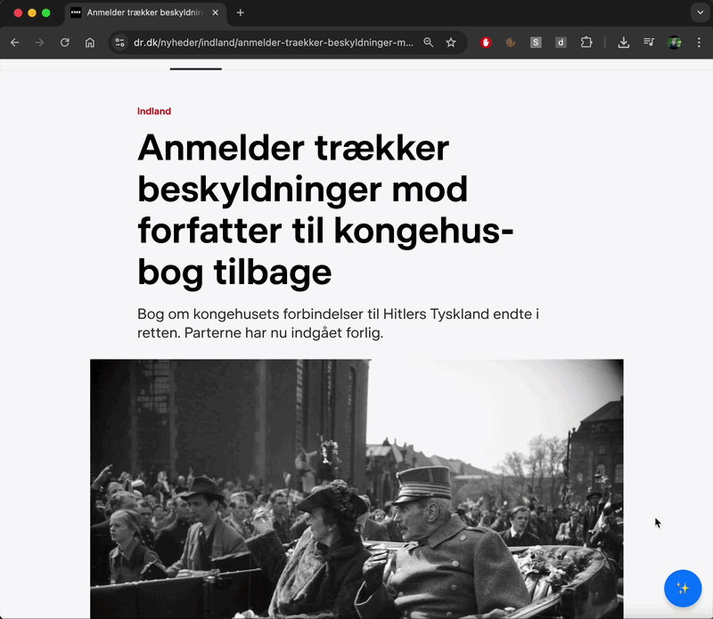

# drdk-ai-summarizer

A Chrome extension that summarizes DR.dk news articles using a local AI model (Ollama).

---

## ✨ What it does

With one click, this extension:

1. Extracts the article content from a DR.dk page
2. Sends it to a local AI backend
3. Returns a concise 3-point summary
4. Displays it in a clean modal UI

👉 The goal is simple: **understand articles in seconds**

---

## 🎥 Demo

See how drdk-ai-summarizer works in practice:



1. Open a DR.dk article  
2. Click the ✨ button  
3. Instantly get a 3-point AI summary in a modal  

---


## 🧠 Example

Click the floating button on a DR.dk article:

```

✨ → 🧠 AI Resumé

- Punkt 1
- Punkt 2
- Punkt 3

```

---

## ✅ Features

- Floating action button injected into DR.dk articles
- Clean extraction of article content (title + paragraphs)
- AI-powered summarization (via Ollama)
- Modal UI with formatted bullet points
- Runs fully locally (no external API required)

---

## 🏗️ Architecture

```

Chrome Extension
↓
FastAPI backend
↓
Ollama (local LLM)

```

### Chrome Extension

- Injects UI (FAB)
- Extracts article text
- Calls backend
- Displays summary in modal

### FastAPI Backend

- Receives article text
- Calls Ollama API
- Returns summary

### Ollama

- Runs locally
- Generates summaries using LLM

---

## 🚀 Getting Started

### 1. Clone repository

```bash
git clone <your-repo-url>
cd drdk-ai-summarizer
```

---

### 2. Start Ollama

Install Ollama: https://ollama.com/

Run:

```bash
ollama serve
```

Pull a model (example):

```bash
ollama pull llama3
```

---

### 3. Start backend

```bash
cd backend
pip install -r requirements.txt
uvicorn main:app --reload --port 8002
```

---

### 4. Load Chrome extension

1.  Go to: `chrome://extensions`
2.  Enable **Developer mode**
3.  Click **Load unpacked**
4.  Select:

<!---->

    chrome-extension/

---

### 5. Use it

1.  Open any DR.dk news article
2.  Click the ✨ button
3.  Get an instant AI summary

---

## ⚙️ Configuration

### Backend endpoint

In `content.js`:

```js
fetch("http://127.0.0.1:8002/summarize", ...)
```

---

### Prompt (Danish summarization)

The backend uses a Danish prompt similar to:

```text
Du er en professionel nyhedsanalytiker.

Opsummer artiklen i præcis 3 korte punkter.
Fokuser på fakta, betydning og konsekvenser.
```

---

### Supported models

Works with any Ollama model, for example:

- `llama3`
- `mistral`
- `phi3`
- `gpt-oss:120b-cloud` (recommended for Danish)

---

## 📁 Project structure

    .
    ├── chrome-extension/
    │   ├── manifest.json
    │   └── scripts/
    │       └── content.js
    └── backend/
        ├── main.py
        └── app/
            ├── routes/
            └── services/

---

## ⚠️ Limitations

- Only supports DR.dk articles (DOM structure specific)
- Requires local Ollama instance
- Large articles may slow down processing
- No offline caching (yet)

---

## 🔮 Future ideas

- Save summaries / history
- Support more news sites
- Improve article extraction robustness
- Add translation / simplification modes
- Keyboard shortcuts

---

## 🧑‍💻 Why this project exists

This project explores:

- Chrome extension development
- FastAPI backend design
- Local LLM integration (Ollama)
- Practical AI tools for everyday use

---

## 📄 License

MIT
